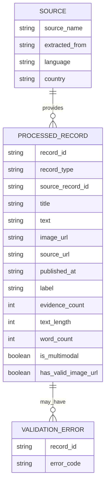

# Conceptual Data Schema

## Objective

This schema documents the processed dataset produced by the transformation pipeline and
its PostgreSQL representation. It separates the business meaning of records from the
storage implementation while keeping both contracts aligned.

The processed dataset combines raw article records and claim-verification records into one exploitable structure for downstream analysis, monitoring, and future machine learning workflows.

## Conceptual Model

## Processed Record Fields

| Field | Type | Required | Meaning | Use Case |
| --- | --- | --- | --- | --- |
| `record_id` | string | Yes | SHA-256-derived identifier built from source identity or canonical record content. | Stable cross-run deduplication and traceability. |
| `record_type` | string | Yes | Either `article` or `claim`. | Separates multimodal publications from labelled claim records. |
| `source_record_id` | string or null | No | Original source identifier, URL, article ID, or claim ID. | Source traceability. |
| `title` | string or null | No | Article title when available. Claims do not use this field. | NLP feature, display. |
| `text` | string | Yes | Cleaned textual content used for analysis. | NLP, classification, quality checks. |
| `image_url` | string or null | No | Image linked to the article record. Claims are text-only. | Image retrieval, multimodal validation. |
| `source_url` | string or null | No | Original article URL when available. | Audit and source lookup. |
| `published_at` | string or null | No | Source publication timestamp. | Freshness monitoring, temporal analysis. |
| `source_name` | string | Yes | Human-readable source or publisher name; `unknown` is used when the source does not provide one. | Grouping, reliability analysis. |
| `extracted_from` | string | Yes | Technical extractor name such as `gdelt`, `rss`, or `fakeddit`. | Pipeline monitoring. |
| `language` | string or null | No | Source-provided language. | Language-specific processing. |
| `country` | list[string] | Yes | Source country or dataset country metadata. | Geographic analysis. |
| `category` | list[string] | Yes | Topic, subreddit, feed category, or source category. | Filtering and exploratory analysis. |
| `label` | string or null | No | Dataset label when available. Live news sources usually have no label. | Supervised learning and evaluation. |
| `evidence_count` | integer | Yes | Number of evidence items attached to a claim. Articles use `0`. | Claim-verification analysis. |
| `text_length` | integer | Yes | Character count of cleaned text. | Data quality KPI. |
| `word_count` | integer | Yes | Word count of cleaned text. | Data quality KPI. |
| `is_multimodal` | boolean | Yes | `true` when a record has text and an image URL. | Core project requirement KPI. |
| `has_valid_image_url` | boolean | Yes | `true` when `image_url` has an acceptable HTTP(S) URL format. | Image quality KPI. |
| `validation_errors` | list[string] | Yes | Validation error codes detected during transformation. | Monitoring and remediation. |
| `loaded_at` | timestamp with timezone | Database only | Timestamp set when the record is inserted or updated in `news_records`. | Load recency and freshness monitoring. |

## Validation Rules

| Rule | Error Code | Applies To | Description |
| --- | --- | --- | --- |
| Text must be present after cleaning. | `missing_text` | Articles and claims | Records with no usable text are not exploitable for NLP. |
| Article image URL should be present. | `missing_image_url` | Articles | Multimodal article records require text and image association. |
| Article image URL must have a valid HTTP(S) URL shape. | `invalid_image_url_format` | Articles with image URLs | Prevents malformed image references from entering the processed dataset unnoticed. |

## Transformation Flow

1. Read raw JSON files from `data/raw/live/`, `data/raw/live/runs/<run_id>/`, or `data/raw/static/` depending on the pipeline mode.
2. Infer record type from file names ending in `_articles.json` or `_claims.json`.
3. Clean whitespace in textual fields.
4. Merge article `title`, `description`, and `content` into a single `text` field.
5. Normalize scalar and list metadata into consistent list fields where needed.
6. Preserve labels from claim records and labelled article datasets when available.
7. Generate validation flags and quality columns.
8. Export processed records to `data/processed/processed_records.json`, `data/processed/runs/<run_id>/processed_records.json`, or `data/processed/static/processed_records.json`.

## Text-Image Association

For article records, the transformed row keeps `text`, `image_url`, `source_url`, `source_name`, and `source_record_id` in the same object. This preserves the association between the publication text and its image throughout the pipeline.

## Storage Contract

- Raw JSON artifacts retain `raw_payload` for traceability. This field is intentionally
  not copied into the processed record or PostgreSQL table.
- `news_records.record_id` is the primary key and makes repeated observations of the
  same source identity idempotent across runs.
- `news_records.country`, `category`, and `validation_errors` are stored as JSONB arrays.
- `news_records.source_name` and `news_records.extracted_from` are non-null; missing
  source names are normalized to `unknown` before loading.
- `news_records_staging` adds `run_id` and isolates concurrent or retrying loads before
  the run-scoped merge.
- `loaded_at` is managed by PostgreSQL and is refreshed when an existing record is
  updated during a merge.
